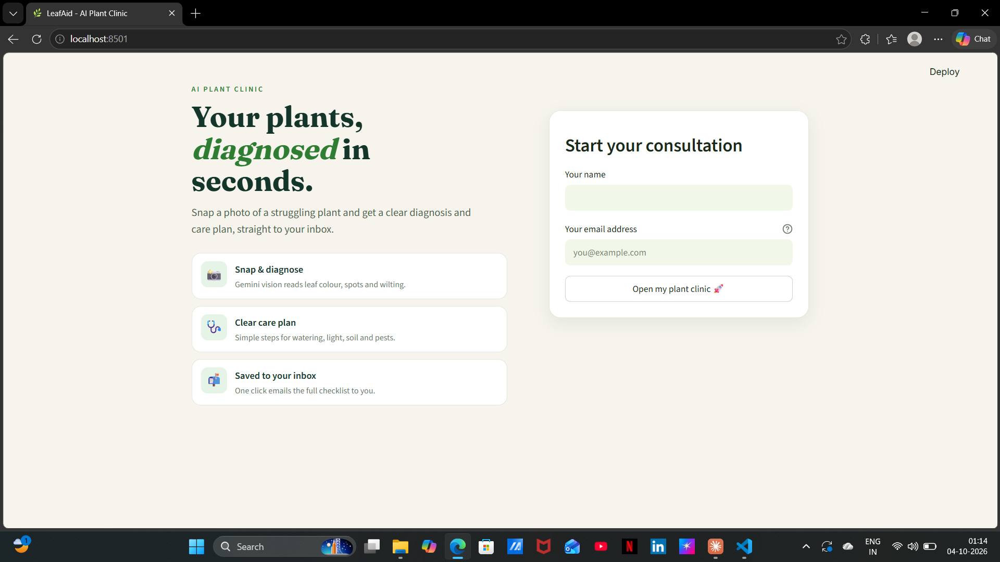
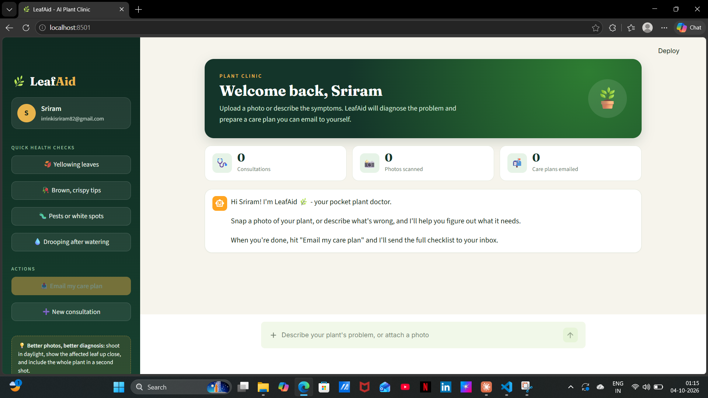
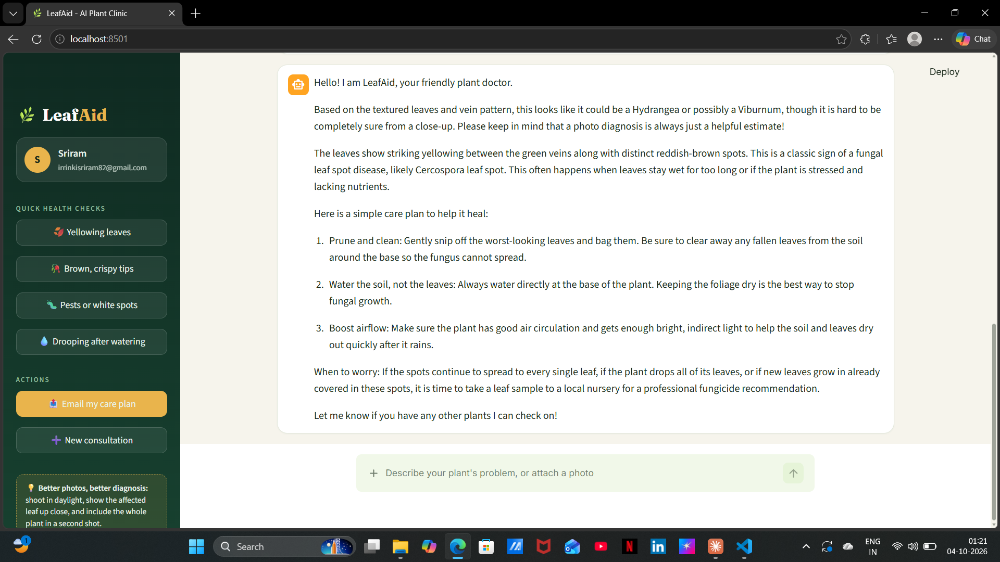
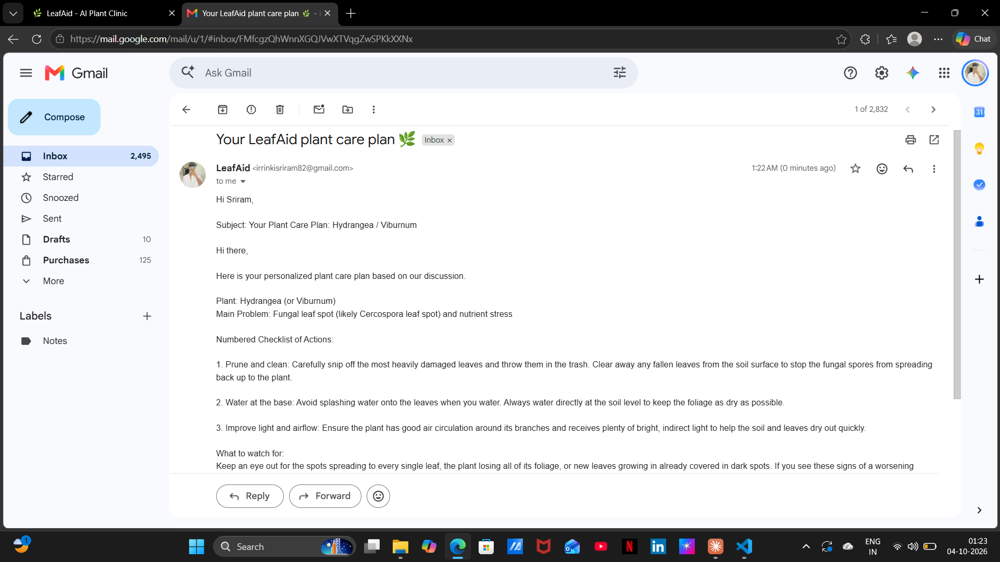
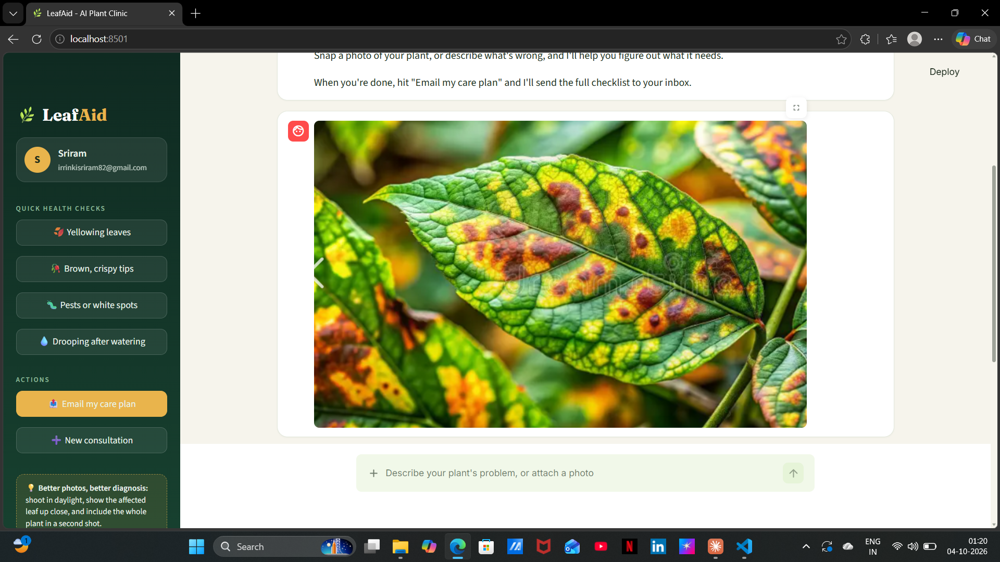

# 🌿 LeafAid - AI Plant Doctor

LeafAid is a Streamlit chat app. Enter your name and email once, then describe a plant problem or attach a photo. Gemini identifies the plant, finds likely problems and suggests simple fixes. One click emails you the full care plan through Gmail.

**Live app:** https://leafaid-sriramnaidu.streamlit.app/

## Features
- Clinic-style dashboard: hero banner, live stats, profile sidebar, one-click health checks
- One chat box for text and photos (Gemini vision)
- Conversation memory for follow-up questions
- System prompt scoped to plants only; politely refuses off-topic requests
- "Email my care plan" generates a clean checklist and sends it via Gmail SMTP
- Input validation, upload size limit (5 MB) and friendly error messages
- Unit tests for validation, Gemini and email logic (no network needed)

## Architecture
```
leafaid/
├── app.py                    # Streamlit UI only
├── config.py                 # loads secrets into a typed Settings object
├── prompts.py                # AI personality, prompts, quick checks
├── ui/
│   ├── styles.py             # dashboard CSS theme
│   └── components.py         # escaped HTML components (hero, stats, profile)
├── services/
│   ├── gemini_service.py     # Gemini chat + vision wrapper
│   ├── email_service.py      # Gmail SMTP sender
│   └── validators.py         # email / name validation
├── tests/                    # pytest suite
├── requirements.txt          # runtime dependencies
├── requirements-dev.txt      # + pytest
└── .streamlit/
    ├── config.toml           # theme and upload limit
    └── secrets.toml.example  # template (real secrets.toml is git-ignored)
```
The UI never talks to Gemini or SMTP directly. It calls the service layer, which keeps each piece easy to test and replace.

## Run locally
Requires Python 3.9+.
```bash
python -m venv venv
source venv/bin/activate        # Windows: .\venv\Scripts\Activate.ps1
pip install -r requirements.txt
cp .streamlit/secrets.toml.example .streamlit/secrets.toml   # then fill in values
streamlit run app.py
```
Get the keys:
1. **Gemini:** https://aistudio.google.com -> Get API key
2. **Gmail App Password:** enable 2-Step Verification on the sending account, then create one at https://myaccount.google.com/apppasswords

## Run the tests
```bash
pip install -r requirements-dev.txt
pytest
```

## Deploy (Streamlit Community Cloud)
1. Push to GitHub (`secrets.toml` is git-ignored).
2. At https://share.streamlit.io choose the repo, branch `main`, and `app.py`.
3. Paste the contents of your `secrets.toml` under Settings -> Secrets.

## Troubleshooting
| Problem | Fix |
|---|---|
| Model not found | Set `GEMINI_MODEL` in secrets to an ID listed in AI Studio |
| Gmail rejected the login | Use the 16-character App Password, not your account password |
| Email not arriving | Check spam; confirm the address on the onboarding screen |

## Security
- Secrets live only in `.streamlit/secrets.toml` (git-ignored) or Streamlit Cloud Secrets.
- Email addresses are validated and headers are injection-safe.
 
  ## Screenshots











**Demo video:** 


_Photo diagnoses are estimates. For serious plant problems, visit a local nursery._
